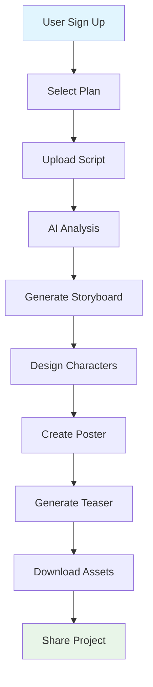

# 🎬 AI Filmmaker Suite

> **Transform your scripts into complete visual productions with AI-powered filmmaking**

[](https://nextjs.org/)
[](https://www.typescriptlang.org/)
[](https://tailwindcss.com/)
[](https://www.prisma.io/)
[](LICENSE)

AI Filmmaker Suite is a comprehensive SaaS platform that empowers filmmakers, indie creators, and content creators to go from **script → storyboard → character design → poster → teaser** entirely using artificial intelligence.

## ✨ Key Features

### 📝 **Script Input & Analysis**
- **Multi-format Support**: Upload scripts in .txt, .pdf, .fountain formats
- **AI-Powered Analysis**: Automatic extraction of scenes, characters, and settings
- **Smart Parsing**: Support for various script formats and structures
- **Interactive Editor**: Built-in script editor with real-time analysis

### 🎨 **Storyboard Generator**
- **Visual Storytelling**: Convert script scenes into stunning visual storyboard frames
- **Multiple Styles**: Cinematic, realistic, anime, comic, noir, watercolor styles
- **Customizable Output**: 1-8 frames per scene with full control
- **Export Options**: PDF or image sequence for production use

### 👥 **Character Design**
- **AI-Generated Concepts**: Create unique character portraits and concept art
- **Multiple Expressions**: Various character emotions and angles
- **Costume Variations**: Different outfit and styling options
- **Style Consistency**: Maintain character design across the entire project

### 🖼️ **Poster & Promo Materials**
- **Professional Posters**: High-quality movie poster generation
- **AI Taglines**: Smart tagline and poster text suggestions
- **Social Media Ready**: Automatic resizing for different platforms
- **Print-Ready**: High-resolution downloads for physical distribution

### 🎥 **Teaser/Trailer Generator**
- **Video Creation**: AI-powered video teaser generation
- **Voice Narration**: AI voice-over for scene descriptions
- **Sound Design**: Background music and sound effects
- **Custom Length**: Adjustable teaser duration and scene selection

### 📊 **Project Management**
- **Multi-Project Dashboard**: Manage multiple film projects efficiently
- **Progress Tracking**: Visual progress indicators for all modules
- **Asset Organization**: Centralized management of all generated content
- **Credit Monitoring**: Track AI API usage and billing

## 🚀 Technology Stack

| Layer | Technology | Description |
|-------|------------|-------------|
| **Frontend** | Next.js 16 + React 19 | Modern React framework with App Router |
| **Language** | TypeScript 5 | Type-safe development |
| **Styling** | Tailwind CSS 4 + shadcn/ui | Utility-first CSS with component library |
| **Database** | SQLite + Prisma ORM | Lightweight database with type-safe queries |
| **AI Services** | z-ai-web-dev-sdk | Pollinations AI integration |
| **File Handling** | React Dropzone | Drag-and-drop file uploads |
| **State Management** | React Hooks + Zustand | Efficient state management |

## 🏗️ Architecture

```
┌─────────────────────────────────────────────────────────────┐
│                    AI Filmmaker Suite                        │
├─────────────────────────────────────────────────────────────┤
│  Frontend (Next.js 16)                                     │
│  ├── Script Input Module     ├── Storyboard Generator       │
│  ├── Character Designer      ├── Poster Generator           │
│  ├── Teaser Generator        ├── Project Dashboard          │
│  └── User Authentication     └── Billing System            │
├─────────────────────────────────────────────────────────────┤
│  Backend (API Routes)                                      │
│  ├── Script Analysis API     ├── Image Generation API      │
│  ├── Video Generation API    ├── Project Management API    │
│  └── User Management API     └── Subscription API          │
├─────────────────────────────────────────────────────────────┤
│  Database (Prisma + SQLite)                               │
│  ├── Users & Subscriptions   ├── Projects & Scenes         │
│  ├── Characters & Designs    ├── Storyboards & Posters     │
│  └── Teasers & Assets        └── Billing & Credits         │
├─────────────────────────────────────────────────────────────┤
│  AI Integration (z-ai-web-dev-sdk)                        │
│  ├── Text Analysis (LLM)     ├── Image Generation (VLM)    │
│  ├── Video Generation        └── Audio Generation (TTS)    │
└─────────────────────────────────────────────────────────────┘
```

## 📦 Database Schema

### Core Models

```sql
User {
  id           String    @id @default(cuid())
  email        String    @unique
  name         String?
  plan         String    @default("free") // free, starter, pro, enterprise
  creditsUsed  Int       @default(0)
  creditsLimit Int       @default(10)
  projects     Project[]
  subscriptions Subscription[]
}

Project {
  id          String   @id @default(cuid())
  title       String
  description String?
  script      String?  // Full script text
  scriptUrl   String?  // Uploaded script file URL
  status      String   @default("draft") // draft, in_progress, completed
  scenes      Scene[]
  characters  Character[]
  storyboards Storyboard[]
  posters     Poster[]
  teasers     Teaser[]
}

Scene {
  id          String   @id @default(cuid())
  sceneNumber Int
  title       String
  description String
  setting     String?
  dialogue    String?
  storyboards Storyboard[]
}

Character {
  id          String   @id @default(cuid())
  name        String
  description String
  appearance  String?
  personality String?
  role        String? // protagonist, antagonist, supporting
  designs     CharacterDesign[]
}

Storyboard {
  id          String   @id @default(cuid())
  frameNumber Int
  imageUrl    String
  style       String   // realistic, anime, comic, cinematic
  description String?
  prompt      String?  // AI prompt used
}
```

## 🎯 User Journey



## 💰 Monetization Strategy

### 🆓 **Freemium Model**
- **Free Tier**: 1 project/month, 10 AI credits, basic features
- **Starter**: $10/month - 5 projects, 100 credits, HD assets
- **Pro**: $30/month - 20 projects, 500 credits, HD + video
- **Enterprise**: Custom - Unlimited projects, team accounts, API access

### 💳 **Pay-per-use Add-ons**
- Extra credit packs
- High-resolution downloads
- Custom AI model training
- Priority processing queue
- Advanced analytics

## 🛠️ Development Setup

### Prerequisites
- Node.js 18+ 
- Bun package manager
- Git

### Quick Start

```bash
# Clone the repository
git clone https://github.com/jitenkr2030/AI-Filmmaker-Suite.git
cd AI-Filmmaker-Suite

# Install dependencies
bun install

# Set up environment variables
cp .env.example .env.local
# Edit .env.local with your configuration

# Initialize database
bun run db:push
bun run db:generate

# Start development server
bun run dev

# Visit http://localhost:3000
```

### Environment Variables

```env
# Database
DATABASE_URL="file:./db/custom.db"

# Application
NEXT_PUBLIC_APP_URL="http://localhost:3000"
NEXT_PUBLIC_API_URL="http://localhost:3000/api"

# AI Services (Get from Pollinations)
Z_AI_API_KEY="your-z-ai-api-key"
Z_AI_WEBHOOK_SECRET="your-webhook-secret"

# Authentication (NextAuth)
NEXTAUTH_SECRET="your-nextauth-secret"
NEXTAUTH_URL="http://localhost:3000"

# Upload Settings
MAX_FILE_SIZE="10485760"  # 10MB
UPLOAD_DIR="./uploads"
```

## 📁 Project Structure

```
AI-Filmmaker-Suite/
├── src/
│   ├── app/                    # Next.js App Router
│   │   ├── api/               # API routes
│   │   │   ├── script/        # Script analysis endpoints
│   │   │   ├── storyboard/    # Storyboard generation
│   │   │   ├── character/     # Character design
│   │   │   ├── poster/        # Poster generation
│   │   │   └── teaser/        # Video generation
│   │   ├── dashboard/         # Dashboard pages
│   │   ├── projects/          # Project management
│   │   └── page.tsx           # Home page
│   ├── components/            # React components
│   │   ├── ui/               # shadcn/ui base components
│   │   ├── ScriptInput.tsx   # Script upload component
│   │   ├── StoryboardGenerator.tsx
│   │   ├── CharacterDesigner.tsx
│   │   ├── PosterGenerator.tsx
│   │   ├── TeaserGenerator.tsx
│   │   └── ProjectDashboard.tsx
│   ├── lib/                  # Utility libraries
│   │   ├── db.ts            # Database client
│   │   ├── auth.ts          # Authentication helpers
│   │   ├── ai.ts            # AI service wrappers
│   │   └── utils.ts         # General utilities
│   └── types/               # TypeScript type definitions
├── prisma/
│   ├── schema.prisma        # Database schema
│   └── migrations/          # Database migrations
├── public/                  # Static assets
│   ├── logo.png            # AI-generated logo
│   └── assets/             # Images, icons, etc.
├── docs/                   # Documentation
├── scripts/                # Build and deployment scripts
└── tests/                  # Test files
```

## 🎨 UI/UX Design

### Design Principles
- **Dark Cinematic Theme**: Professional filmmaker aesthetic
- **Responsive Design**: Mobile-first with desktop enhancements
- **Accessibility**: WCAG 2.1 AA compliance
- **Performance**: Optimized for fast loading and smooth interactions

### Color Palette
```css
/* Primary Colors */
--primary: #147EFF;      /* Bright Blue */
--primary-dark: #0D4FD8; /* Deep Blue */
--secondary: #9333EA;    /* Purple */
--accent: #EC4899;       /* Pink */

/* Dark Theme */
--background: #0F172A;   /* Slate-900 */
--surface: #1E293B;      /* Slate-800 */
--border: #334155;       /* Slate-700 */
--text: #F1F5F9;         /* Slate-100 */
```

## 🔧 API Documentation

### Script Analysis
```typescript
POST /api/script/analyze
Content-Type: application/json

{
  "title": "My Movie Script",
  "content": "FADE IN: ...",
  "format": "fountain"
}

Response:
{
  "title": "My Movie Script",
  "summary": "A thrilling adventure...",
  "scenes": [...],
  "characters": [...],
  "settings": [...]
}
```

### Storyboard Generation
```typescript
POST /api/storyboard/generate
Content-Type: application/json

{
  "scene": {
    "number": 1,
    "title": "Opening Scene",
    "setting": "Mountain peak at dawn",
    "description": "Hero stands alone..."
  },
  "frameNumber": 1,
  "style": "cinematic",
  "totalFrames": 3
}

Response:
{
  "imageUrl": "https://...",
  "sceneNumber": 1,
  "frameNumber": 1,
  "style": "cinematic"
}
```

## 🚀 Deployment

### Vercel (Recommended)
```bash
# Install Vercel CLI
npm i -g vercel

# Deploy to Vercel
vercel --prod
```

### Docker
```dockerfile
FROM node:18-alpine AS base
WORKDIR /app
COPY package.json bun.lockb ./
RUN bun install --frozen-lockfile

FROM base AS builder
COPY . .
RUN bun run build

FROM base AS runner
WORKDIR /app
COPY --from=builder /app/public ./public
COPY --from=builder /app/.next/standalone ./
COPY --from=builder /app/.next/static ./.next/static

EXPOSE 3000
ENV PORT 3000
CMD ["node", "server.js"]
```

### Self-Hosted
```bash
# Build for production
bun run build

# Start production server
bun run start

# Or use PM2 for process management
pm2 start ecosystem.config.js
```

## 📈 Performance Optimization

### Frontend Optimizations
- **Code Splitting**: Automatic route-based splitting
- **Image Optimization**: Next.js Image component with WebP
- **Font Optimization**: Self-hosted fonts with preload
- **Bundle Analysis**: Regular bundle size monitoring

### Backend Optimizations
- **Database Indexing**: Optimized queries for large datasets
- **API Caching**: Redis for frequent API calls
- **CDN Integration**: Cloudflare for static assets
- **Rate Limiting**: Prevent abuse and manage costs

### AI Integration
- **Request Batching**: Group multiple AI requests
- **Prompt Caching**: Cache repeated prompt results
- **Fallback Models**: Multiple AI providers for reliability
- **Cost Monitoring**: Real-time credit usage tracking

## 🧪 Testing

### Unit Tests
```bash
# Run unit tests
bun test

# Run with coverage
bun test --coverage
```

### Integration Tests
```bash
# Run API integration tests
bun test tests/api/

# Run E2E tests
bun test tests/e2e/
```

### Manual Testing Checklist
- [ ] Script upload and analysis
- [ ] Storyboard generation
- [ ] Character design creation
- [ ] Poster generation
- [ ] Video teaser creation
- [ ] Project management
- [ ] User authentication
- [ ] Payment processing

## 🔒 Security

### Authentication & Authorization
- **NextAuth.js**: Secure authentication with multiple providers
- **JWT Tokens**: Secure session management
- **Role-Based Access**: Different permissions for user tiers
- **API Rate Limiting**: Prevent abuse and manage costs

### Data Protection
- **Input Validation**: Comprehensive input sanitization
- **File Upload Security**: Type and size restrictions
- **SQL Injection Prevention**: Parameterized queries with Prisma
- **XSS Protection**: Content Security Policy and input escaping

### Infrastructure Security
- **HTTPS Only**: Enforce SSL/TLS in production
- **Environment Variables**: Secure secret management
- **Regular Updates**: Keep dependencies up to date
- **Security Headers**: OWASP recommended headers

## 🤝 Contributing

We love contributions! Please see our [Contributing Guide](CONTRIBUTING.md) for details.

### Development Workflow
1. **Fork** the repository
2. **Create** a feature branch (`git checkout -b feature/amazing-feature`)
3. **Commit** your changes (`git commit -m 'Add amazing feature'`)
4. **Push** to the branch (`git push origin feature/amazing-feature`)
5. **Open** a Pull Request

### Code Style
- **TypeScript**: Strict mode enabled
- **ESLint**: Configured with Next.js rules
- **Prettier**: Consistent code formatting
- **Husky**: Pre-commit hooks for quality

### Commit Messages
```
type(scope): description

feat(dashboard): add project statistics
fix(api): resolve script parsing error
docs(readme): update installation guide
```

## 📄 License

This project is licensed under the MIT License - see the [LICENSE](LICENSE) file for details.

## 🙏 Acknowledgments

- **[Pollinations.ai](https://pollinations.ai)** - AI generation platform
- **[Next.js](https://nextjs.org)** - React framework
- **[Prisma](https://www.prisma.io)** - Database toolkit
- **[shadcn/ui](https://ui.shadcn.com)** - Component library
- **[Tailwind CSS](https://tailwindcss.com)** - CSS framework

## 📞 Support

- **Documentation**: [Full documentation](https://docs.aifilmmaker.ai)
- **Discord**: [Join our community](https://discord.gg/aifilmmaker)
- **Twitter**: [@AIFilmmakerAI](https://twitter.com/AIFilmmakerAI)
- **Email**: support@aifilmmaker.ai

## 🗺️ Roadmap

### Phase 1: Core Features ✅
- [x] Script input and AI analysis
- [x] Storyboard generation
- [x] Project dashboard
- [x] Basic user management

### Phase 2: Advanced Features (Q2 2024)
- [ ] Character design module
- [ ] Poster generation
- [ ] Video teaser creation
- [ ] User authentication

### Phase 3: Production Ready (Q3 2024)
- [ ] Subscription system
- [ ] Payment integration (Stripe)
- [ ] Advanced AI models
- [ ] Team collaboration

### Phase 4: Scale & Optimize (Q4 2024)
- [ ] Mobile applications
- [ ] API for third-party integration
- [ ] Advanced analytics
- [ ] Enterprise features

---

<div align="center">

**🎬 Transform your creative vision into reality with AI-powered filmmaking!**

[](https://github.com/jitenkr2030/AI-Filmmaker-Suite)
[](https://github.com/jitenkr2030/AI-Filmmaker-Suite/fork)
[](https://github.com/jitenkr2030/AI-Filmmaker-Suite)

Made with ❤️ by the AI Filmmaker Suite team

</div>